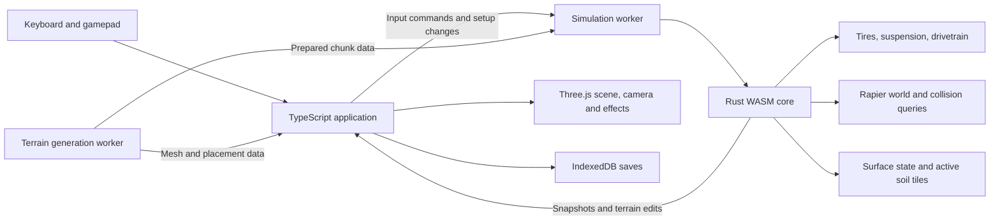

# Offroad exploration game — architecture and implementation plan

Status: proposed design with an initial truck visual rig; no driving simulation or performance benchmarks exist yet.
Prepared: 2026-09-15.
Target: desktop browser, keyboard and gamepad, single-player exploration.

## 1. The experience

Build a game in which choosing a line through terrain and feeling the vehicle
respond is the main activity. A good first experience is a slow climb across
uneven rocks: one tire rises, the axle articulates, the body leans, a lightly
loaded tire slips, and engaging a differential lock changes the outcome.

The same vehicle should behave differently on firm rock, wet grass, deep mud,
and snow. Lowering tire pressure or changing damping should produce an
observable change that the player can understand without reading telemetry.

Believability comes from consistent causes and consequences. We can support
an enormous engine or an unusually long-travel crawler while preserving
weight transfer, limited traction, drivetrain losses, and suspension limits.

### Required features

- Trucks, Jeep-like 4x4s, and purpose-built crawlers.
- Individually visible tire movement, steering, and wheelspin.
- Independent suspension and physically coupled solid-axle suspension.
- Tire grip dependent on load, slip, tire properties, and ground state.
- Engine torque curve, RPM, gearing, braking, and engine braking.
- RWD, FWD, and 4WD through actual torque routing.
- Open and locked differentials; limited-slip differentials as a later increment.
- Adjustable tire pressure and suspension settings.
- Rock, grass, mud, and snow with distinct physical behavior.
- Procedural terrain that offers interesting routes and recognizable landmarks.
- Downloaded vehicle models attached to reusable simulation rigs.
- Recovery, exploration progress, and saved vehicle setups.

### Initial scope

Start with one generic four-wheel crawler and a compact proving ground.
Then build one bounded, seeded mountain valley with connected routes.
Use daytime lighting and fixed weather initially; surface wetness and snow
can be authored/generated without building a live weather system.

The first exploration release includes mud and snow deformation. A
dry-terrain driving prototype is an earlier milestone, not completion of the
user's requested experience.

Defer multiplayer, traffic, economies, races, detailed crash deformation,
full fluid simulation, finite-element tires, and a complete mechanical
failure model. A recovery winch is a useful later exploration feature;
reset-to-safe-ground is sufficient for the first playable build.

## 2. Recommended stack

| Responsibility | Choice | Reason |
|---|---|---|
| Rendering | Three.js with TypeScript | Direct control over terrain, vehicles, cameras, and effects. |
| Initial renderer | WebGLRenderer / WebGL 2 | Keep the first physics milestone on a straightforward rendering path. |
| Application tooling | Vite, TypeScript, pinned dependencies | Small browser application with fast development iteration. |
| Simulation host | Dedicated Web Worker | Physics work should not block input handling or rendering. |
| Simulation implementation | Rust crate compiled to WASM | Keep vehicle calculations and the rigid-body world together; allow native headless tests. |
| Rigid bodies and collision queries | Rapier 3D | Rust-native collision, contact, joints, and spatial queries. |
| Vehicle behavior | Custom module | The requested tires, axles, drivetrain, and soil exceed a basic vehicle controller. |
| Interface and menus | HTML/CSS; lightweight TypeScript state | Keep DOM layout separate from the per-frame scene update. |
| Vehicle assets | glTF/GLB plus rig metadata | Separate visual assets from physical parameters. |
| Saves | IndexedDB plus explicit export/import | Local exploration and tuning persistence without a backend. |

Rapier's JavaScript package already runs WebAssembly. Writing our own Rust
module does not automatically make the application faster. The reason to
choose it here is ownership of the complete simulation loop, access to
Rust-side APIs, and reusable native testing. We will measure the boundary
and the workload. [Rapier JavaScript setup](https://rapier.rs/docs/user_guides/javascript/getting_started_js/)

The proposed Rust crate owns its own Rapier world. Do not also create an
independent JavaScript Rapier world and attempt to exchange body handles
between the two WASM modules.

Rapier documents rigid bodies, joints, queries, and optional determinism.
Those are engine capabilities, not evidence that our vehicle model will be
correct. [Rapier overview](https://rapier.rs/docs/)

### Renderer choice

Three.js also offers WebGPURenderer with a WebGL 2 fallback. Its materials
and postprocessing have a different migration path, and the current manual
still identifies limitations. Reconsider it when terrain shading or visual
effects justify the switch; do not maintain two material pipelines initially.
The initial WebGL choice is a project decision, not a claim that WebGL is
faster. [Three.js renderer guide](https://threejs.org/manual/en/webgpurenderer)

### Alternatives and decision boundaries

- TypeScript vehicle math plus Rapier WASM is a viable simpler alternative.
  Use it if the initial Rust build/debug workflow proves disproportionately
  expensive; preserve the worker protocol and test scenarios.
- Jolt has wheel collision testers using rays, sphere casts, and cylinder
  casts. It is a bounded fallback investigation if Rapier integration blocks
  the contact experiment, not a second full engine to integrate now.
  Its documented tester options do not prove soft-terrain support.
  [Jolt wheel collision testers](https://jrouwe.github.io/JoltPhysicsDocs/5.2.0/class_vehicle_collision_tester.html)
- Project Chrono is a reference for separating tires, terrain, and test rigs.
  This plan does not propose porting that simulator to the browser.

## 3. Runtime architecture



The generation worker is introduced when chunk generation becomes expensive.
It is not needed for the first flat test scene. Only the simulation worker
owns active physics state and commits terrain changes.

Generation produces immutable chunk data keyed by seed, generator version,
and global coordinates. If it uses WASM, it has a separate generation-only
instance; it does not share Rapier handles or mutate the active world.
Install completed chunks in a recorded order at tick boundaries so worker
completion timing does not silently change a replay.

### Timing

- Initial physics target: 120 fixed steps per simulated second.
- Initial rendering target: 60 frames per second on a named desktop test device.
- These are starting targets, not measured guarantees.
- A fixed-step accumulator advances physics independently of display refresh.
- If stiff contacts need smaller steps, test a fixed 240 Hz configuration
  before adding state-dependent substep policies.
- Additional contact queries and vehicle force updates must run inside any
  full physics substep. Repeating only wheel-spin math does not resolve
  chassis contact or suspension coupling errors.
- Timestamp snapshots and interpolate body, axle, carrier, and wheel poses
  from the same pair of simulation states.
- Do not interpolate across resets, teleports, or origin shifts.
- Limit catch-up work. Report sustained overload and lower visual quality;
  never silently replace the fixed step with a large variable step.
- On a long stall or background-tab transition, pause and resynchronize the
  clock. Do not simulate minutes of backlog on resume.
- Clear held input on blur, disconnect, and pause.

### Crossing the worker/WASM boundary

Use one batched command upload and a compact snapshot export per update.
Do not issue JavaScript calls for every tire contact or every force.
Keep tire math, queries, soil sampling, and force application inside Rust.

Start with a small pool of transferable ArrayBuffers. A transferred buffer
changes ownership; do not reuse it until returned. Copy snapshot data out
of WASM linear memory into an owned transfer buffer. Never try to detach
the live WASM memory. Recreate typed views if WASM memory grows.
[Transferable objects](https://developer.mozilla.org/en-US/docs/Web/API/Web_Workers_API/Transferable_objects)

SharedArrayBuffer is an optional measured optimization. It requires
cross-origin isolation and an explicit synchronization protocol; it is not
needed to run a single-threaded WASM module inside a worker.
[SharedArrayBuffer](https://developer.mozilla.org/en-US/docs/Web/JavaScript/Reference/Global_Objects/SharedArrayBuffer)

### Stable interfaces

The following names describe contracts, not existing APIs:

```ts
type InputCommand = {
  sequence: number;
  steer: number;       // -1..1
  throttle: number;    // 0..1
  brake: number;       // 0..1
  handbrake: number;   // 0..1
  shiftRequest: -1 | 0 | 1;
  directionRequest: 'forward' | 'neutral' | 'reverse' | null;
};

type SnapshotHeader = {
  schemaVersion: number;
  tick: number;
  simulationTime: number;
  originRevision: number;
  worldRevision: number;
  lastInputSequence: number;
  discontinuity: boolean;
};

// Large repeated fields use documented typed-array layouts.
// IDs and revisions use integer fields rather than float-packed IDs.
```

Snapshot payload includes chassis and axle transforms, individual wheel
poses/spin, engine RPM, gear, contact flags, suspension travel, normal loads,
slip, surface IDs, and terrain revision references. HUD telemetry can be
published at a lower rate than transforms.

Commands for pause, recovery, chunk installation, and tuning changes have
explicit IDs and acknowledgments. Apply them atomically at tick boundaries.
The worker rejects invalid settings and returns a useful validation message.

## 4. Physics model and its limits

### Coordinates and units

- Use meters, kilograms, seconds, newtons, newton-meters, radians, and pascals.
- World up is +Y; vehicle right is +X; vehicle forward is -Z.
- Use right-handed rotations and document each axle's positive spin sign.
- Display degrees, PSI/kPa, km/h/mph, and horsepower only at UI boundaries.
- Define mass, center of mass, and inertia independently of the render mesh.
- Use a compact local physics origin and global chunk coordinates.
- Seed generation independently of rendering frame count.

### Chassis

Use a dynamic rigid body with a small compound collider assembled from
convex shapes. Include the belly, bumpers, and other gameplay-relevant
clearance. A vehicle must be able to high-center on a rock.

Use explicit sprung and unsprung mass accounting. Axle/wheel masses must
not also be counted inside the chassis mass. Derive an initial inertia
estimate from simple mass shapes and permit overrides in the vehicle data.

Suspension and tire forces act at their actual application points so that
roll, pitch, and weight transfer emerge. Do not fake cornering with a
body-uprighting torque in the default simulation.

### The first research gate: wheel contact

This is the least certain and most consequential part of the plan.
An engine raycast vehicle is a useful baseline, but a single downward ray
does not describe a tire wrapping over a rock or meeting the front of a ledge.
Rapier's supplied controller explicitly uses raycast wheels.
[Rapier vehicle controller](https://docs.rs/rapier3d/latest/rapier3d/control/struct.DynamicRayCastVehicleController.html)

Build two narrow experiments using the same chassis, tire dimensions,
surface fixtures, and input recordings:

| Candidate | Model | What must be demonstrated |
|---|---|---|
| A — custom footprint | Swept rounded wheel volume plus a small set of tread/width contact samples; custom tire support and tangential response | Smooth crawling, simultaneous contacts, pressure-dependent compliance, and manageable integration complexity. |
| B — rigid wheel contact | Articulated rigid wheel bodies and engine-resolved ground contact; progressively customized tire behavior | Good ledge/sidewall collision, stable joints, and a feasible way to introduce load-dependent tire behavior. |

Candidate A is the preferred direction for controllable offroad tire and
soil behavior. Candidate B is the comparison and fallback if custom contact
cannot meet the ledge and stability gates. Do not implement two complete
vehicle systems. Choose one before committing the production suspension
and tire code.

The candidate choice must explicitly settle:

1. Who owns normal support and who owns tangential friction.
2. How wheel spin and tire forces exchange angular momentum.
3. How suspension constraints and contact are coupled each substep.
4. How current normal load is obtained for the friction limit.
5. How multiple contacts share load without multiplying available grip.
6. How pressure changes compliance/contact geometry.
7. How soft ground and rigid rocks coexist beneath the same tire.

### Contact implementation rules

For candidate A, wheel query geometry does not also receive ordinary
Rapier wheel-ground contact response. Chassis, axle housing, and rim/obstacle
colliders can still have explicitly assigned roles. A rim collision is not
a second tire support model.

Use shape sweeps/overlap tests to discover obstacles around the wheel,
including frontal and side contacts. Downward casts alone are insufficient.
Refine meaningful contact regions with a bounded sample set. A starting
experiment might use 3–9 tread samples; that count is a tuning hypothesis.

Preserve distinct contact patches on a ledge and the ground. Do not average
their normals into a fictitious ramp. Distribute normal load using contact
depth/compliance and normalize patch weights so adding samples cannot
increase total support or traction.

Candidate A needs a coupled, stable contact update: prototype an implicit
or projected impulse solve for tire compliance, wheel rotation, and the
effective mass seen through suspension. Do not assume that a stiff explicit
spring force applied once before an engine step will remain stable.

Contacts must be unilateral: they can push the tire away from the surface,
but cannot pull an airborne tire back toward it. Contact friction must
oppose relative slip or store/release bounded elastic shear energy. Warm
starting and contact-history reuse need stable patch identity and must be
invalidated when a wheel leaves the surface or changes contact geometry.

For candidate B, ordinary engine normal impulses and custom tire forces
must not double-count the same force. Replacing friction with custom
longitudinal/lateral impulses requires careful load timing and coupling.
Using last-step load is an approximation to test, not an accepted solution
for landing transients or a guarantee that anisotropic tires are easy.

Rapier exposes contact inspection and modification, but the documented
hook cannot add arbitrary new contacts. Check the pinned Rust API during
the spike; do not assume a hook is a general custom-constraint extension.
If an engine fork is required, record that cost and reconsider the candidate.
[Rapier contact hooks](https://rapier.rs/docs/user_guides/rust/advanced_collision_detection/)

If neither candidate meets the gate, extend the physics experiment and
report the failure. Increasing terrain/art scope cannot resolve it.

## 5. Suspension that moves and matters

### Independent suspension

Represent each wheel carrier's travel, sprung/unsprung mass interaction,
spring force, and damping. Start with a guided travel axis; add a
kinematic curve for camber/toe and linkage geometry where needed.
Do not initially simulate every control arm as a separate rigid body.

### Solid axles

Represent an axle with a shared pose and unsprung mass. Its left and right
wheels share axle motion. Model axle heave and roll, two suspension
attachments, and appropriate lateral/longitudinal guidance.

For a reduced-coordinate implementation, solve those coupled axle degrees
of freedom. For a multibody implementation, use an axle rigid body and
suitable constraints. The chosen contact spike determines the implementation.
Drawing an axle between unrelated wheel positions is not sufficient.

Steering knuckles rotate relative to the front axle; the axle housing
does not steer as a whole. Allow front-independent/rear-solid trucks and
solid/solid crawlers through configuration.

Generic joint limits and motors are available in Rapier. Their existence
does not establish the stability of a particular suspension arrangement;
validate mass ratios and limits on the rig.
[Rapier generic joints](https://docs.rs/rapier3d/latest/rapier3d/dynamics/struct.GenericJoint.html)

### Forces and tuning

Model the following:

- Spring rate and preload/rest position.
- Separate compression and rebound damping.
- Travel, bump stops, and droop limits.
- Front/rear anti-roll coupling, including a disconnect option.
- Wheel/axle unsprung mass.
- Tire vertical compliance, distinct from suspension compliance.
- Mechanical leverage between a spring and wheel when applicable.

With compression x positive into the spring, the scalar support magnitude
can be expressed as `F_preload + k*x + c*dx/dt + F_bump(x)` in the relevant
compression regime. Apply force direction/signs from the attachment geometry.
Damping must oppose relative motion; bump stops act only near compression
limits. Droop limits are constraints, not tire adhesion.

For a simple single-degree spring, `c_critical = 2*sqrt(k*m_effective)` is
a useful initial damping estimate. It is not a substitute for the actual
coupled axle model. Define motion ratio as spring travel / wheel travel;
under locally constant geometry the wheel rate scales with its square.

Expose front/rear presets and advanced per-corner settings where meaningful.
Changing ride height, preload, spring rate, and travel are different actions.
The UI should not hide all of them behind a single "suspension quality" slider.

### Visual binding

Drive visual wheel transforms from simulation output. Compose mount pose,
steering, spin, and tire deformation in separate nodes. Animate shocks
between attachment points; drive axle housings and shafts from their
physical/kinematic endpoints.

Apply cosmetic interpolation only in the renderer. Cosmetic spring or
body animation must not change collision geometry or feed back into physics.

## 6. Tire grip, wheelspin, and inflation

### State per tire

Track angular speed, spin angle, loaded radius, normal load, contact patches,
longitudinal/lateral relative velocity, tread state, pressure, and transient
contact deformation. Keep tire parameters separate from terrain parameters.

Wheel rotation follows a torque balance:

`I_wheel * dω/dt = T_drive - T_brake - Σ(F_long * r_effective) - T_loss`

This abbreviated scalar equation assumes a consistent axle sign convention.
Apply the corresponding reaction forces and torques to the vehicle and any
dynamic contacted body. Forces on the body must not also be duplicated as
an additional chassis propulsion force.

### Hard-surface tire model

Start with a brush-inspired transient model: the contact patch develops
elastic shear before sliding, then saturates. Parameters control stiffness,
peak/sliding friction, load sensitivity, and transient response.
Use measured tire data if it becomes available; do not label invented
coefficients as calibrated real-world tires.

Compute slip in the contact frame using the ground's local velocity, including
motion of dynamic rocks/platforms. A stabilized diagnostic slip ratio can be:

`slip = (r*ω - v_long) / max(abs(v_long), abs(r*ω), v_regularization)`

This is a project convention, not a universal tire formula. Low-speed force
generation must remain meaningful when that ratio approaches zero/zero.

Limit combined acceleration/braking and cornering using a friction ellipse:

`(F_long / F_long_max)^2 + (F_lat / F_lat_max)^2 <= 1`

On a simple hard surface, each limit depends on `μ * normal_load` with
load/tire modifiers. Splitting one patch into several samples must not
increase the shared force budget. Airborne tires have no ground grip.

### Crawling and coming to rest

Near zero speed, use a static-contact/elastic-shear or bounded constraint
regime with hysteresis, continuous transition, and the same traction limit.
This regime must handle applying small drive torque while creeping uphill.
Do not stabilize it by freezing the chassis or granting infinite hill grip.

Test starting, stopping, reversing, and holding with brakes on both sides
of the transition. Gravity must overcome static traction when appropriate.
The engine/clutch and brakes must determine whether an unbraked vehicle rolls.

Low-speed tire singularities and sticky-contact alternatives are documented
in established vehicle systems; our exact thresholds require experiments.
[PhysX low-speed tire discussion](https://nvidia-omniverse.github.io/PhysX/physx/5.4.0/_api_build/struct_px_vehicle_tire_axis_sticky_params.html)

### Tire pressure

Pressure changes a bounded effective model of:

- Vertical stiffness, deflection, and loaded rolling radius.
- Contact footprint length/shape and terrain conformity.
- Sidewall compliance and lateral response.
- Rolling resistance and soft-ground ground pressure.
- Visual sidewall bulge/contact flattening.

`footprint_area ≈ load / inflation_pressure` is only an intuition/initial
estimate. Carcass stiffness, tread, geometry, and substrate matter; the
production footprint must have plausible bounds and continuous behavior.

Lower pressure must not apply an unconditional grip multiplier. It may
improve flotation and conformity while increasing rolling losses and
reducing steering precision. A tire's optimal range depends on load,
construction, terrain, and speed.

Use a simplified visual deformation shader or mesh deformation driven by
the same load/pressure state. Keep the rim rigid. Rendering deformation is
an approximation and must not imply collision accuracy we do not have.

Provide per-axle pressure controls first, with per-tire overrides later.
Change pressure while stopped/paused in the initial tuning UI. Validation
must reject nonpositive pressure and invalid tire geometry without
forbidding deliberately unusual vehicles.

## 7. Engine and drivetrain

### Torque path

```text
throttle -> engine torque at current RPM
         -> clutch / simple automatic coupling
         -> gearbox
         -> transfer case / center coupling
         -> axle differential(s)
         -> individual wheel torque
         -> tire forces at ground contact
```

Store an engine torque curve versus RPM, idle/redline, engine inertia,
throttle response, drag, and driveline efficiency. Derive power:

`power_W = torque_Nm * angular_speed_rad_per_second`

Horsepower is a display conversion (declare mechanical hp or metric PS).
Do not tune horsepower and torque as unrelated multipliers. A horsepower
target can scale the torque curve coherently in the vehicle editor.

Implement forward ratios, neutral, reverse, and low range. Start with a
simple clutch plus automatic gear selection; permit manual gear selection.
An idle controller and auto-clutch improve accessibility. Keep stall behavior
and assistance settings explicit; engine braking should work on descents.

### Driven wheels and differentials

| Setup | Behavior to implement |
|---|---|
| RWD | Drive torque reaches only the rear axle. |
| FWD | Drive torque reaches only the front axle. |
| 4WD high/low | Transfer gearing and center coupling drive both axles. |
| Open axle differential | Ideal equal output torque with the differential speed relation; a lightly resisted wheel can limit useful traction. |
| Locked axle differential | Constrain relative wheel speed, allowing unequal reaction torques; turning scrub follows naturally. |
| Limited slip | Bounded coupling/preload transfers torque while allowing speed difference. |

An open differential does not simply assign all torque to the wheel that
is spinning. A locker does not merely assign 50% torque to each wheel.
The constraints, wheel inertias, and available ground reactions matter.

Part-time 4WD with a locked center connection differs from AWD with a center
differential. Include those semantics in configuration even if only
selectable RWD/4WD high/low ships initially. Make FWD available as a test
configuration and later vehicle preset.

Account for transmission efficiency without creating power. Apply clutch
and differential reactions consistently; do not count torque both as wheel
acceleration and an additional drivetrain force on the chassis.

Use speed matching and finite coupling for locker/range changes. Initially
allow range changes only when stopped and make that condition clear in the UI.

### Steering and braking

- Keyboard steering/throttle use controllable ramps, not instantaneous steps.
- Gamepad steering has deadzone, response curve, and return behavior.
- Approximate Ackermann steering based on wheelbase/track where applicable.
- Expose steering angle limits separately from input sensitivity.
- Service brakes have axle bias and finite brake torque.
- Parking brake acts on configured wheels.
- ABS/traction control are optional assists after the unassisted model works.
- Reverse requires an explicit direction command or a clearly defined
  near-stationary input behavior; braking must not unexpectedly reverse uphill.

## 8. Surface materials and deformable ground

### Surface model

Separate the material label from its current state. "Mud" is not one
friction number, and snow can exist over rock, grass, or compacted soil.

| Surface | Initial physical ingredients | Visible cues |
|---|---|---|
| Dry/wet rock | Hard contact, roughness/conformity, wetness-dependent friction | Exposed rock geometry, wet sheen, tire contact deformation. |
| Grass over soil | Surface shear, wetness, underlying soil strength | Flattened vegetation, exposed dirt under repeated passage. |
| Mud | Depth, bearing strength, shear strength, sinkage, drag, tread clogging | Ruts, displaced edges, splashes, mud accumulation. |
| Snow | Layer depth, compaction, resistance, loose versus packed traction | Compressed tracks, powder displacement, exposed substrate. |

All coefficient values begin as tunable game parameters. Expected trends
must be stated per fixture; wetness and compaction need not have the same
effect in every material.

### Two stages of soft ground

First implement depth-aware, nonpersistent surface forces on test patches.
Then implement persistent terrain edits. This separates force calibration
from meshing and streaming bugs while keeping the target physical behavior.

Use a sparse grid of active surface tiles around the vehicle. Each cell
stores substrate height, loose-layer thickness, compaction, moisture,
permanent displacement, and relevant shear/tread interaction history.
Store seed-derived base terrain separately from modified cells.

The first model is an empirical game approximation inspired by terrain
mechanics, not a reproduction of a validated soil simulator. Different
terrain/tire model classes have compatibility constraints in engineering
simulators too. [Chrono terrain model overview](https://api.projectchrono.org/vehicle_terrain.html)

### Coupled sinkage and traction

At a contact footprint:

1. Resolve the supporting layer and any rigid obstacles.
2. Estimate support pressure from load and footprint.
3. Solve a bounded pressure-versus-sinkage response against the substrate.
4. Compute available soil shear from material, normal stress, compaction,
   and accumulated shear displacement.
5. Integrate longitudinal/lateral resistance over the footprint with a
   shared force budget; do not add a full hard-road grip budget on top.
6. Apply rolling/plowing resistance opposing motion through soft material.
7. Update permanent compression/rutting with elapsed contact time and
   dissipated slip work, bounded by material depth and rate limits.
8. Persist the result and emit terrain/visual changes for that revision.

Initial support may use `pressure = K * sinkage^n` with explicit units for
K and an authored exponent. Tune against a defined fixture before adding
more elaborate terramechanics parameters. Snow additionally distinguishes
recoverable compression from permanent packing.

The model must distinguish loose material, packed material, and a firm base.
Repeated wheelspin may dig deeper or clog tread; excessive throttle can
worsen progress. Compaction can improve support without guaranteeing more
grip, particularly for packed snow.

Do not subtract sinkage both from the terrain elevation and again from the
wheel suspension position. Tire compliance and soil deformation are separate
terms in one contact solution.

Tread contamination accumulates in mud and clears with a bounded speed/time
law. It changes tire parameters and appearance. Begin with one scalar
contamination state, not a tread-block simulation.

### Deformation and collision consistency

Render and physics consume the same authoritative height/state data.
Shader-only ruts can be an early visual test but do not satisfy physical ruts.

For the first physical-deformation version, use small collision tiles that
can be rebuilt and replaced at fixed-step boundaries. Wheel queries and
underbody contact must see the same committed revision. Apply depth and
rate limits so collider replacement cannot abruptly swallow the chassis.
Benchmark rebuilding before selecting grid resolution or edit frequency.

Use prepare/commit messages for terrain revisions: prepare collision and
render resources, acknowledge readiness, then commit on a named physics tick.
Render snapshots against their matching terrain revision; retain the prior
revision until interpolation no longer references it. Bound pending revisions
and coalesce dirty cells if rendering or collision preparation falls behind.
Document any intentionally smoothed cosmetic transition separately from the
authoritative supporting surface.

If tile rebuilding misses the budget, prototype a shared local support
surface used for both tires and underbody, or lower the physical edit rate
while accumulating state. This is a separate gate; stale underbody collision
under visible deep ruts is not an accepted shortcut.

Nearby rocks keep independent colliders and can protrude through soft layers.
Start with fixed rocks; only a bounded set of small loose props becomes
dynamic later. Surface blending must not erase rigid ledges.

Particles, displaced snow puffs, wet splashes, and mud decals are visual
responses to simulated events. They do not need individual rigid bodies.

## 9. Procedural terrain with routes worth exploring

### Bounded first world

Initial world target: roughly a 1 km by 1 km valley, adjusted after traversal
and streaming tests. A few hundred meters with excellent terrain is a valid
first exploration milestone. Size is a design target, not a performance claim.

Create a region layout before adding noise:

1. Place a valley, ridges, drainage paths, and a few high viewpoints.
2. Connect landmarks with a route graph containing a forgiving route,
   optional technical shortcuts, and turnaround/recovery spaces.
3. Shape base elevation around those decisions using layered noise,
   domain warping, and later erosion-inspired passes.
4. Cut trails, shelves, switchbacks, gullies, and crossings into the terrain.
5. Place rock formations and obstacle groups with collision-aware spacing.
6. Assign surfaces from slope, altitude, drainage, exposure, and authored masks.
7. Add grass, shrubs, scree, snow deposits, and visual microdetail.
8. Validate continuity, clearance, route slopes, spawns, and chunk borders.

Use procedural assembly of authored obstacle templates for rock gardens,
cross-axle holes, stepped climbs, and muddy bypasses. Pure random height noise
is insufficient for route pacing and line choice.

### Suggested region layout

- Grassy base camp for tuning and recovery.
- Forest trail with roots, wet grass, and shallow mud.
- Rocky drainage with articulation obstacles and alternate lines.
- Deep mud basin with a longer firm-ground bypass.
- Alpine approach with loose and packed snow sections.
- Ridge viewpoint that gives the player a destination and reveals routes.

A reference vehicle should be able to complete the main route. Hard routes
can require different gearing, tire choices, or more careful line selection.
Difficulty metadata assists generation; vehicle traversal tests and human
playtesting determine whether it is actually fun and navigable.

### Geometry and streaming

Use heightfields for ordinary ground and separate meshes/colliders for
overhangs, bridges, and distinct rock formations. A heightfield cannot
represent a cave ceiling or two surfaces at the same horizontal coordinate.
Rapier provides heightfield and other collider types; choose appropriate
shapes rather than treating the entire scene as one detailed dynamic mesh.
[Rapier colliders](https://rapier.rs/docs/user_guides/javascript/colliders/)

- Separate render detail levels from collision detail levels.
- Keep near-wheel ground geometry physically faithful.
- Derive border vertices from shared global samples; weld/match collision edges.
- Give chunk generation stable seeds and a generator version.
- Introduce a local floating origin when measured precision requires it.
- Shift every body, terrain chunk, camera state, cached contact location,
  and interpolation snapshot consistently when rebasing.
- Keep distant terrain and vegetation cheap through mesh LOD and instancing.
- Load collision ahead of the vehicle using speed, stopping distance, and
  measured worst-case generation/install time.
- Commit collision before allowing entry. If loading falls behind, slow/pause
  entry at a safe boundary with a brief loading state.
- Keep the whole vehicle and its contact support region inside retained chunks.
- Never remove a supporting collider or replace its resolution under a tire
  without an explicit stable transition.
- Rebuild the same heightfield triangulation for rendering and collision near
  tires; differing diagonals can create visible contact discrepancies.

Store terrain deltas by global chunk/cell address so tire tracks survive
unloading and revisits. Physics must not depend on visual LOD selection.

## 10. Vehicle model pipeline

An initial Brown Beast truck visual rig has been extracted from the user's
download into `assets/vehicles/brown-beast/`. See `ASSET_REPORT.md` there for
the source inspection, named parts, node hierarchy, previews, and validation.
This is asset preparation; the physical vehicle model and full T09 acceptance
criteria remain open.

### What to look for when downloading models

Prefer glTF/GLB or a format that can be cleanly exported from Blender.
Look for separate wheel meshes, usable suspension parts, coherent scale,
good pivots, PBR materials, and a license suitable for the intended game.
Three.js supports glTF through GLTFLoader.
[GLTFLoader](https://threejs.org/docs/pages/GLTFLoader.html)

Separate wheels are the most valuable requirement. A beautiful single fused
truck mesh cannot articulate without editing. A purchased/downloaded model
does not automatically contain mass, torque, suspension, or tire data.

### Import procedure

1. Normalize meters, axes, scale, and transforms in Blender or an import tool.
2. Separate the chassis, wheels, axle housings, and useful suspension pieces.
3. Put wheel pivots at the hub centers and record rotation axes.
4. Mark suspension/steering attachment points.
5. Build simple chassis, belly, and axle collision proxies separately.
6. Create rig metadata mapping visual nodes to simulation parts.
7. Add physical data and validate ride height, wheelbase, track, and clearance.
8. Generate texture/mesh LODs after the vehicle works.
9. Validate maximum steering plus full bump/droop for obvious clipping.

Initially, substitute procedural wheels/shocks/axles where an asset lacks
usable parts. The prototype should not wait for final truck models.

### Data separation

```text
VehicleDefinition
  identity and schema version
  sprung mass, center of mass, inertia
  chassis and underbody collision geometry
  axle definitions and suspension topology
  wheel mounts, travel geometry, steering limits
  tire model references and default pressures
  engine torque curve, inertia, idle and redline
  gear ratios, transfer case, differential configuration
  brake torque and bias
  visual rig reference

VehicleSetup
  vehicle definition/version reference
  pressure by axle/tire
  spring/preload and compression/rebound damping overrides
  ride height and anti-roll settings
  gear/final-drive overrides where supported
  selected assists and drivetrain settings

SurfaceDefinition
  material identity and schema version
  hard-surface friction and load behavior
  soil support/shear/resistance parameters
  moisture/compaction response
  visual material/effect references
```

Validate finite positive mass/inertia/pressure, ordered torque curves,
consistent travel limits, valid gear ratios, and compatible references.
Report physically implausible configurations as information where useful,
but reject configurations that are numerically invalid.

Numerical limits are explicit. If extreme settings exceed the supported
stiffness/step envelope, explain the limit or select a validated higher
simulation-quality preset; do not silently add grip or reduce torque.

## 11. Exploration, cameras, feedback, and tuning

### Basic player loop

Choose a vehicle/setup, leave base camp, spot a destination, try a route,
adjust a setup when stopped, recover if stuck, and discover another route.
There is no requirement for timers or an economy to make this enjoyable.

### Camera

- A damped third-person chase camera with obstacle avoidance.
- Orbit/inspection control for placing tires while crawling.
- A low wheel/axle inspection view to make articulation easy to see.
- Optional free camera while paused for tuning and screenshots.
- Smooth camera response independently from actual chassis motion.
- User controls for shake, sensitivity, inversion, and recentering.

### Information and controls

Show speed, RPM/gear, selected drive mode, differential locks, and a compact
optional tire/travel display. Keep the world readable without debug overlays.
Provide remappable keyboard controls and gamepad-accessible menus with
visible focus. Camera orbit and steering must remain usable together.

Use a standard gamepad mapping when available and offer remapping for other
controllers. Vibration is optional feedback, not a requirement for driving.
Detect WebGL 2/WASM/worker initialization failures and show an actionable
startup message. Record exact tested Chrome, Firefox, and Safari versions
at release; an untested browser is not implicitly certified by this plan.

Expose tuning in a stopped/paused garage panel with named presets and
short explanations. Preserve a known-working default and support setup
comparison on the same obstacle. UI units and physical meaning must be clear.

### Sound and effects

- Engine sound follows RPM and load, not just vehicle speed.
- Tire slip and surface type drive scrub/spin sound.
- Suspension events drive subtle compression/bump-stop effects.
- Soil state drives mud spray, snow displacement, and surface accumulation.
- Force/slip event intensity is normalized so substep count does not multiply
  particle emission or audio triggers.

### Saving and recovery

Save the world seed/generator version, vehicle definition/setup version,
discovered locations, checkpoints, and modified terrain cells.
Save at safe stopped points and resume from a validated placement initially.
Exact mid-crash restoration is a separate feature requiring all solver,
contact, soil, wheel, and drivetrain state.

Maintain a last-safe location after validating support and clearance.
Recovery places the complete vehicle, clears transient input/contact state,
resets interpolation, and preserves exploration/setup data. A raw teleport
into unloaded ground is not a valid recovery implementation.

Handle storage failure visibly and provide export/import of progress and
setups. Saves reference a schema version with explicit migrations or a clear
unsupported-version message.

## 12. Performance and correctness strategy

### Measure a named workload

At project bootstrap, record CPU, GPU, OS, browser, resolution, power mode,
and build configuration for a reference desktop/laptop. Choose that baseline
before claiming a frame-rate target has been met.

Initial budget hypotheses:

| Metric | Starting target | Measurement |
|---|---|---|
| Rendering | 60 fps at 1080p on the reference device | Frame-time distribution and GPU timing where supported. |
| Physics | 120 fixed steps/s | Worker step duration, p50/p95/p99, accumulated backlog. |
| Physics step | p95 under about 4 ms | Includes tires, soil, Rapier, and command processing; leaves headroom inside 8.33 ms. |
| Snapshot path | Small fraction of a frame | Serialization, copy/transfer, receipt, interpolation, and state age. |
| Streaming | No entry into missing collision | Generation/install latency and main/worker stalls. |
| Long session | Bounded resident growth | Repeated chunk loops, terrain edits, GPU resource disposal, and saves. |

The frame and worker budgets overlap in wall time; do not add them as if
both run serially on the same thread. CPU contention can still affect both.

Compare a simulation-only WASM run with rendering disabled, then enable
rendering, effects, and streaming in stages. Use identical recorded inputs
and terrain to attribute performance changes.

Optimize allocations, query counts, collision geometry, terrain tile work,
and draw calls based on profiles. SIMD, multithreaded WASM, and GPU compute
are optional follow-ups, not promised speed multipliers.

### Required test fixtures

These are planned checks. None have been executed yet.

| Fixture | What it proves |
|---|---|
| Static level platform | Total support approximately equals weight; correct static ride height and axle loads. |
| Drop/bounce rig | Damping dissipates motion; bumps settle; no continuing energy growth. |
| Single-wheel lift and diagonal holes | Independent/solid-axle coupling, visible travel, droop, and unloading. |
| Rock ledge, narrow ridge, tire side contact | Wheel volume contact, no obvious pass-through, no fictitious averaged ramp. |
| Slope start/stop/reverse | Stable low-speed transition and finite traction; brake hold versus free rolling. |
| One tire unloaded / split grip | Open differential, locker, RWD/FWD/4WD behavior. |
| Constant-radius turn plus throttle/brake | Combined grip limit, steering geometry, believable understeer/oversteer. |
| Same tire at several pressures | Continuous deflection, resistance, and terrain-specific response. |
| Mud/snow depth ladder | Sinkage/resistance trends, finite support, excessive-spin consequences. |
| Repeated tracks and revisits | Persistent compaction/ruts; matching visual and physical surface. |
| Belly-on-rock / deep rut | Underbody contact and high-centering. |
| 30/60/144 Hz render schedules | Same fixed simulation behavior within defined numerical tolerance. |
| Input loss, pause, reload, recovery | No stuck throttle, unwanted backlog, or invalid vehicle placement. |
| Chunk border and load delay | Seamless contact and safe streaming behavior. |
| Extreme valid vehicle presets | Finite state and clear limits for unusual vehicles. |

Use scalar analytical checks for units, torque/power conversion, simple
equilibrium, and passive energy dissipation. Use simulation scenarios for
coupled behavior; do not fill the suite with tests that merely repeat formulas
from the implementation without testing physical outcomes.

Record fixture dimensions, tire radius, speed, pressure, solver settings,
normal loads, energy/velocity trends, and expected outcomes with each result.
Thresholds are fixed before evaluating a model. Initial proposals include
level support within 2% of weight after settling and no secular energy growth
in an unpowered passive rig; revise only with a documented physical reason.

For ledges, record successful obstacle height as a ratio of tire radius,
approach angle, gearing, and available traction. Do not require climbing an
arbitrary vertical wall or hide contact failure with an automatic step-up.

Use same-build replay for regressions. Do not promise cross-browser bitwise
determinism based only on engine settings: ordering, custom math, seeds,
commands, and terrain commits must also be deterministic. Pin compiler,
engine, and data versions for comparisons.
[Rapier determinism](https://rapier.rs/docs/user_guides/templates/determinism)

### Tuning discipline

Keep a realistic baseline vehicle and an exaggerated stress-test vehicle.
Change one subsystem at a time on recorded fixtures, then playtest routes.
Every exposed slider must change a defined physical parameter and have at
least one scenario demonstrating its effect.

Keep debug overlays for contact points/normals, force vectors, wheel travel,
axle poses, center of mass, slip, terrain depth, and solver time. This is
essential development tooling for a physics-led game.

## 13. Implementation roadmap

The order is driven by risk. Each milestone has a playable or measurable
result. Calendar estimates should follow the contact/soil spikes because
those determine the amount of custom simulation work.

| Milestone | Depends on | Deliverable and completion gate |
|---|---|---|
| M0 — foundation and contact decision | None | Three.js shell, Rust/WASM worker, headless harness, primitive vehicle, common obstacle fixtures, and measured A/B contact decision. |
| M1 — dry-terrain driving | M0 | Stable tire/suspension model, torque curve/gears/brakes, RWD/FWD/4WD, open/locked differentials, visible axle/wheel poses, keyboard/gamepad control. |
| M2 — tuning and vehicle variety | M1 | Meaningful pressure/spring/damper settings, independent and solid axles, saved setups, one imported model, and three data-driven vehicle presets. |
| M3 — soft-ground physics | M1; pressure model from M2 | Grass, rock, depth-aware mud/snow, sinkage/shear/resistance, tread contamination, and passing material fixtures. |
| M4 — exploration terrain | M1 | Seeded valley, route graph, obstacle placement, chunk streaming, camera, landmarks, and safe recovery. |
| M5 — persistent ground and progress | M3, M4 | Physical ruts/compaction, collision/render revision agreement, chunk revisit persistence, and versioned saves. |
| M6 — first exploration release | M2, M5 | Integrated exploration loop, polished feedback, accessible controls, and measured performance/stability across supported desktop browsers. |

M2 and M4 can be developed independently after M1; M3's pressure-dependent
acceptance waits for the pressure model. These are dependency opportunities,
not a requirement to run multiple coding agents.

### First playable demonstration

A primitive crawler in a small proving ground with:

- An articulation ramp and offset holes.
- A rough rock climb with a bypass.
- A slope for starting, stopping, and engine braking.
- A split-grip pad for drivetrain comparisons.
- A low camera that clearly shows each wheel and axle.
- Controls for drive mode, lockers, pressure, and damping as they arrive.
- Debug contact/force views and input recording.

The demonstration is successful when the player can explain why a setup or
driving input changed the climb. It should be enjoyable with placeholder art.

## 14. Task graph for implementation

The task identifiers below are stable planning IDs. Tasks include relevant
validation as part of delivery; a task is not complete merely because its
configuration fields or UI exist.

These tasks are also recorded in the local `.beads` tracker, with titles
prefixed T01–T15. The planning check verified 15 open tasks, 27 blocking
edges, no dependency cycles, and T01 (`cp-a6a`) as the only initially ready
task. Use `br ready --json` to find the next available implementation task.
The exported task graph is `.beads/issues.jsonl`.

The first release graph covers open and locked differentials. Limited-slip
differentials, a winch, dynamic weather, and additional wheel counts are
follow-up work after T15; they must not delay the core exploration loop.

| ID | Task | Blocked by | Unblocks |
|---|---|---|---|
| T01 | Browser/Rust workspace and worker contract | — | T02, T03 |
| T02 | Headless fixtures, telemetry, record/replay | T01 | T03 and all physics validation |
| T03 | Contact candidates and selection report | T01, T02 | T04, T05 |
| T04 | Production suspension and axle coupling | T03 | T06, T08, T09 |
| T05 | Hard-surface tire response and wheel dynamics | T03 | T06, T08 |
| T06 | Engine, transmission, drive modes, differentials | T04, T05 | T07, T09, T13 |
| T07 | Keyboard/gamepad driving, camera, recovery on test ground | T06 | T11, T15 |
| T08 | Tire pressure, suspension tuning, setup schema | T04, T05 | T10, T13, T15 |
| T09 | Vehicle definitions, visual rigs, import workflow | T04, T06 | T13, T15 |
| T10 | Soft-material force and sinkage model | T08 | T12 |
| T11 | Seeded route-oriented terrain and streaming | T07 | T12, T14 |
| T12 | Physical deformation with matching collision | T10, T11 | T14, T15 |
| T13 | Crawler/4x4/truck presets and comparative calibration | T06, T08, T09 | T15 |
| T14 | Persistent world edits, exploration progress, save migration | T11, T12 | T15 |
| T15 | Integrated exploration, feedback, release validation | T07, T08, T09, T12, T13, T14 | First exploration release |

### T01 — application and simulation boundary

Create the Vite/TypeScript application and a small Rust workspace with
native and WASM builds. Initialize one worker-owned simulation and render
one body from snapshots. Pin versions and record the reference machine.
Pass pause/resume, buffer ownership, error propagation, and input sequence
checks. This makes every later experiment run through the intended runtime.

### T02 — fixture runner and diagnosis

Build deterministic fixture construction, scripted input, telemetry export,
and a visual debug scene. Implement level support/drop/slope fixtures first;
add the ledge and split-grip fixtures before contact selection. Compare
render schedules and native/WASM outcomes using stated tolerances. The
runner must identify the first failing tick and relevant settings.

### T03 — tire contact decision

Implement only the narrow candidate A and B prototypes described in section 4.
Use matched dimensions and physical parameters. Test front/side ledges,
diagonal loading, stationary slope behavior, and a pressure/compliance spike.
Record normal/friction ownership, solver integration, CPU cost, and observed
failure cases. Select one with evidence; do not close the task on a visually
smooth flat-road demo. Failure blocks production tire/axle implementation.

### T04 — suspension mechanics

Implement independent travel and a coupled solid axle using T03's chosen
contact/body architecture. Include sprung/unsprung mass, spring/preload,
compression/rebound damping, stops, and anti-roll coupling. Export physical
attachment poses for rendering. Pass support, bounce, droop, articulation,
and passive-energy tests with a supported range of settings.

### T05 — tire response

Implement per-wheel rotation, relative contact velocity, static/rolling/sliding
transition, load-sensitive hard-surface grip, combined-force limits, and
reaction forces. Test reverse, coast-down, slope starts, wheel unloading,
and turning under throttle/braking. Publish slip/load diagnostics without
letting display filtering influence forces.

### T06 — drivetrain

Implement engine torque curve/RPM/inertia, clutch/auto-clutch, gear selection,
reverse/neutral, low range, losses, finite brakes, and engine braking.
Route torque through open/locked axle and center arrangements for RWD,
FWD, and selectable 4WD. Validate split grip and an unloaded wheel, finite
locker engagement, power accounting, and an unpowered descent.

### T07 — playable test ground

Add remappable keyboard and gamepad controls, smoothing/deadzones, chase and
inspection cameras, compact instruments, pause, reset, and last-safe recovery.
Build the proving-ground loop. Verify gamepad disconnect and tab blur clear
input, reverse is intentional, and recovery never places the vehicle inside
terrain. A player must be able to inspect tire placement while driving slowly.

### T08 — meaningful setup controls

Implement bounded pressure-dependent compliance/footprint/radius/resistance
and associated visuals. Add front/rear and advanced suspension tuning,
units, presets, validation, and export/import of versioned setup data.
Demonstrate effects on the same recorded obstacles, including cases where
lower pressure or softer damping is disadvantageous.

### T09 — vehicle rig data and model import

Define versioned physical and visual schemas, axis conventions, collision
proxies, attachment mapping, and a validation report. Bind wheels/axles/shocks
to simulation poses and import one licensed model. Verify full travel and
steering, dimensions, loaded ride height, and underbody clearance. Retain
a procedural debug rig so physics tests do not require the art asset.

### T10 — materials and soft-ground forces

Implement material/state sampling shared by tire and terrain systems.
Add grass, wet/dry rock, and layered mud/snow patches. Solve bounded support,
sinkage, shear, rolling/plowing resistance, and tread contamination with
explicit units and no duplicate traction budget. Pass depth/pressure/spin
comparisons on fixed patches before adding persistence or large terrain.

### T11 — exploration world and streaming

Create the seeded region/route graph, terrain samples, landmark placement,
surface assignment, and authored obstacle templates. Generate seamless chunks
with separate visual and collision detail. Stage installation with revisions,
retain active support chunks, and handle delayed loading safely. Pass repeat
seed, chunk edge, reference-vehicle main-route, and traversal-memory checks.

### T12 — deformation that affects driving

Persist bounded compaction/rut state in active soil tiles. Commit physical
collision and tire queries against the same revision used for visible
deformation. Include underbody support and exposed substrate/rocks. Benchmark
tile rebuilding and verify that following a rut changes the route physically.
Particles and shader grooves alone do not satisfy this task.

### T13 — vehicle variety and tuning calibration

Add a short solid-axle crawler, a general-purpose 4x4, and a longer truck
with suitable axle topology. Distinguish them through wheelbase, track,
mass/center of mass, travel, gearing, tires, and clearance. Add an exaggerated
but numerically valid preset. Demonstrate predictable differences on the same
fixtures and ensure data changes do not require separate vehicle controllers.

### T14 — save/load and exploration state

Persist seeds/generator versions, setups/definition versions, discovered
locations, safe checkpoints, and chunk terrain deltas. Restore active physics
from a validated stopped spawn; implement schema migration/error reporting and
export/import. Test unloading/revisiting terrain, browser reload, storage
failure, and unsupported save versions. Bound retained in-memory tile history.

### T15 — integrated release

Connect terrain routes, vehicle/setup selection, exploration discovery,
recovery, audio, particles, and visual feedback. Verify the full desktop
keyboard/gamepad loop and the fixture suite in supported browsers. Profile
the worst measured rock/mud/snow/streaming scenes on the reference device,
fix identified bottlenecks, and state remaining limitations with results.

## 15. Proposed repository layout

```text
apps/game/
  src/app/              startup, menus, input, settings
  src/render/           scene, terrain meshes, vehicles, effects
  src/camera/           chase, orbit, inspection
  src/bridge/           worker protocol and snapshot decoding
  src/workers/          simulation host and terrain generation host
  src/storage/          saves, setup import/export, migrations
crates/simulation/
  src/world/            Rapier integration and simulation timing
  src/vehicle/          chassis, axle topology, vehicle construction
  src/tire/             contact, compliance, traction, wheel dynamics
  src/drivetrain/       engine, clutch, gearing, differentials, brakes
  src/terrain/          material sampling, soil state, physical tiles
  src/bridge/           WASM exports and packed snapshots
  src/scenarios/        headless fixture construction and replay
data/
  vehicles/            physical definitions and setup presets
  tires/               tire parameter sets
  surfaces/            material and soil presets
  regions/             generation and route templates
assets/
  vehicles/            models, rig mappings, licensing records
  terrain/             textures and reusable formations
docs/
  experiments/         contact decision and benchmark results
  formats/             data/protocol contracts and migration notes
```

This is a proposed organization, not generated scaffolding. Start with only
the directories needed for M0; split modules as their responsibilities appear.

## 16. Uncertainties and decision gates

| Risk | Early evidence needed | Response if it fails |
|---|---|---|
| Custom tire contacts jitter or miss rocks | Candidate comparison on ledges, sidewalls, and rest | Rework contact representation/coupling or select the alternate candidate before production physics. |
| Solid axle/joint instability | Bounce/articulation tests over mass and spring ranges | Simplify linkage degrees of freedom, improve implicit coupling, and document supported settings. |
| Low-speed tire forces oscillate | Start/stop/reverse on slopes | Correct static-contact transition and torque coupling; do not mask with chassis freezing. |
| Mud/snow feel like uniform drag | Depth, pressure, spin, and repeated-pass comparisons | Improve support/shear state before adding particles or more biomes. |
| Physical rut updates are too expensive | Small-tile collision rebuild benchmark | Adjust resolution/rate or prototype unified local support without permitting contradictory surfaces. |
| Rust boundary costs outweigh benefits | End-to-end worker/binding timings | Batch or simplify data flow; evaluate TypeScript custom math if necessary. |
| Procedural world lacks interest | A short main route plus optional technical lines | Improve templates, landmarks, and route pacing before expanding map size. |
| Downloaded models cannot articulate | One early import with full travel/steering | Edit/replace parts or retain procedural running gear. |

The unresolved contact and deformation choices are deliberate experiments,
not claims of already proven technology. Their task gates prevent the later
plan from depending on an untested assumption.

## 17. Plan review record

This section records local design review, not independent expert validation
or executed tests. The implementation task graph remains open.

- Physics review: distinguish pressure from a grip multiplier; couple solid
  axles; conserve torque/force reactions; separate tire and soil compliance.
- Engine/API review: treat the contact model as an experiment; document
  Rapier hook limits and the single-world WASM boundary.
- World/player review: connect routes and landmarks; include underbody
  collision, safe recovery, input loss handling, and persistent physical ruts.
- Delivery review: order tasks by contact/soil risk; define completion with
  observable behavior and benchmarks; label all performance numbers as targets.

The final delivery pass checked task descriptions and dependency edges
against this document. It required no structural architecture changes.
These planning checks do not validate any unimplemented game physics.

The next implementation action is T01, followed by the instrumented contact
experiment. The main product judgment at the first playable milestone is:
does carefully placing and loading the tires feel satisfying and predictable?
