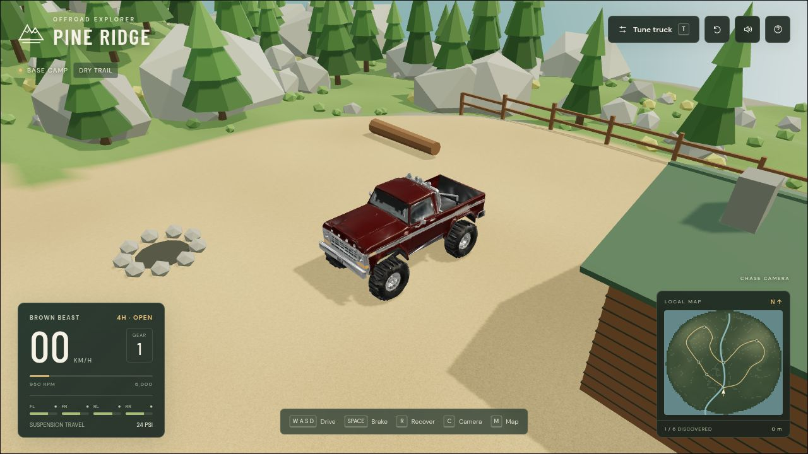
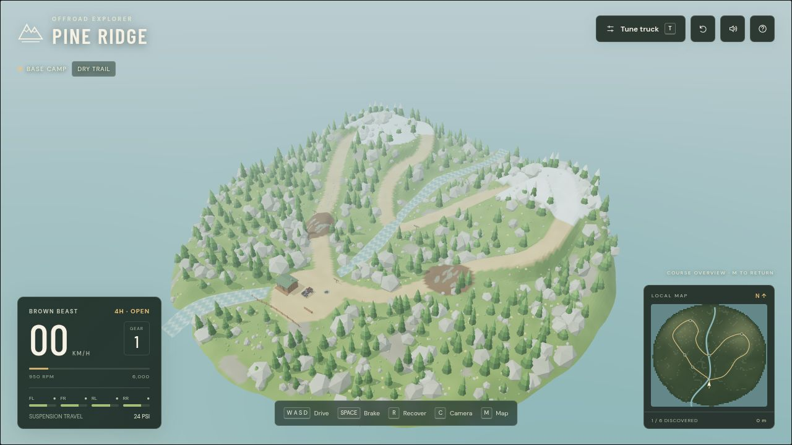
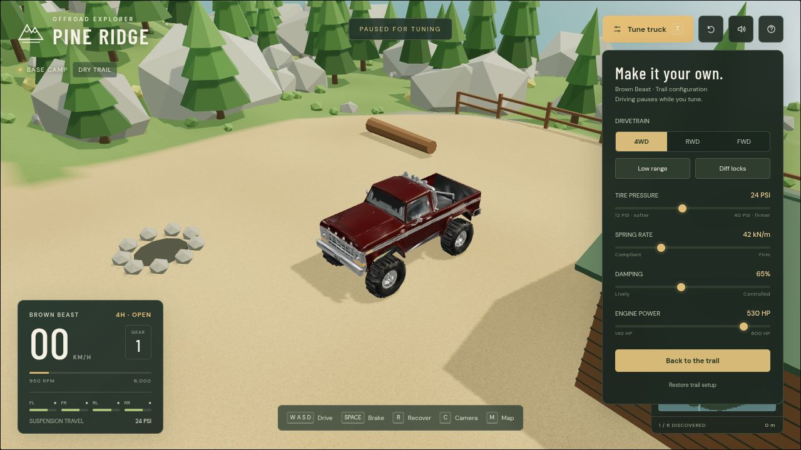

# Pine Ridge

### Take the long way.

A lifted truck, a winding mountain trail, and no clock to beat. **Pine Ridge** is a desktop-browser offroad playground about choosing a line, watching the suspension work, and finding out what’s over the next ridge.



**Playable prototype · Keyboard + gamepad · Three.js + Rapier WASM**

## One truck. Six places to get sidetracked.

Start at the cabin with **Brown Beast**, a lifted pickup with separately animated tires, steering, axles, and suspension links. Follow the loop through the pines, nose into the rock garden, cross the creek, or work your way toward the snowy high ground.

There’s no race timer. Pick a route, experiment with the truck, and recover to camp when your ambition exceeds your traction.

| Try this | What’s in the demo |
| --- | --- |
| Find a better line | A seeded 192 × 192 m proving ground with trails, rocks, pines, mud, snow, and a stream |
| Watch the truck work | Snapshot-driven wheelspin, steering, suspension travel, and visual axle articulation |
| Change the setup | 4WD / RWD / FWD, low range, diff locks, tire pressure, springs, damping, and engine power |
| Read the terrain | Material-dependent grip and rolling resistance, plus water drag |
| Explore all six landmarks | Base camp, Mud hollow, Rock garden, West lookout, Creek crossing, and Pine summit |
| Keep your bearings | Minimap, course overview, multiple cameras, discovery count, and distance traveled |



## Get behind the wheel

You’ll need repository access, Git, **Node.js 22.12+** and npm, and a desktop browser with WebGL2 enabled. The runtime truck asset is included; Blender is only needed if you want to rebuild the rig.

```bash
git clone git@github.com:dackerman/truck-game.git
cd truck-game
npm ci
npm run dev -- --host 127.0.0.1 --port 5173
```

Open **http://127.0.0.1:5173/**, wait for the suspension to settle, and click the game. If that port is busy, use the address Vite prints.

Prefer HTTPS? Clone with `git clone https://github.com/dackerman/truck-game.git` using your authenticated GitHub account.

**First lap:** leave camp, follow the trail toward Mud hollow, then try the Rock garden. Press **T** to change the setup and compare how the truck responds. Press **R** whenever you need a fresh start.

## Controls

| Action | Keyboard / mouse | Gamepad |
| --- | --- | --- |
| Forward throttle | **W** / Up | RT |
| Brake, then reverse | **S** / Down | LT |
| Steer | **A / D** or Left / Right | Left stick |
| Service brake | Space | A |
| Recover to camp | R | Y |
| Change camera | C | X |
| Course overview | M / click minimap | — |
| Tune truck | T | — |
| Pause | P | Start |
| Look around / zoom | Drag / scroll | — |

**W keeps applying forward drive even when the truck rolls backward.** Driven wheels also spin when airborne or upside down. **S brakes forward travel, then starts reversing once stopped**; hold it through the transition. Space brakes the wheels, including their airborne spin.

Opening tuning or help pauses the simulation. Switching away from the tab also pauses it. Engine sound is optional: use the speaker button.

## Build your kind of bad idea

Want a soft trail crawler? Start with low range and modest power. Curious about a 600 hp front-wheel-drive pickup? The tuning panel lets you try it.



| Setting | Default | Available |
| --- | --- | --- |
| Driven wheels | 4WD | 4WD, RWD, FWD |
| Low range | On | On / off |
| Diff locks | On | On / off |
| Tire pressure | 24 PSI | 12–40 PSI |
| Spring rate | 42 kN/m | 25–85 kN/m |
| Damping ratio | 0.65 | 0.25–1.20 |
| Engine power | 280 hp | 140–600 hp |

Your setup saves automatically in this browser. **Restore trail setup** brings back the defaults. Screenshots show a customized setup. Landmark discoveries reset when the page reloads.

## Under the hood

The design starts with three priorities: make the truck respond consistently, make its moving parts visible, and keep experimentation one keypress away.

```text
Keyboard / gamepad → main.ts → commands → physics.worker.ts
                        ↑                         │
                 interpolated snapshots     120 Hz fixed steps
                        │                         │
                 Three.js renderer         Rapier + vehicle model
                 ├─ truck.ts                └─ physics.ts
                 └─ environment.ts
                        ↑                         ↑
                        └── shared world data ────┘
                              world.ts
```

Rendering and terrain collision use the same generated mesh. Physics runs in a dedicated worker; the main thread interpolates snapshots to animate the truck. Rapier supplies WASM rigid-body simulation, with the vehicle and drivetrain layer written in TypeScript.

| File | Start here for… |
| --- | --- |
| [`src/main.ts`](src/main.ts) | Input, cameras, HUD, menus, audio, and startup |
| [`src/physics.ts`](src/physics.ts) | Vehicle forces, braking, drivetrain, tuning, and reset |
| [`src/physics.worker.ts`](src/physics.worker.ts) | Fixed-step scheduling and snapshots |
| [`src/world.ts`](src/world.ts) | Terrain generation, surfaces, and landmarks |
| [`src/environment.ts`](src/environment.ts) | Terrain visuals, trees, rocks, water, and camp |
| [`src/truck.ts`](src/truck.ts) | Animated truck rig |
| [`src/protocol.ts`](src/protocol.ts) | Shared messages, wheel mounts, and setup defaults |
| [`tests/driving.test.ts`](tests/driving.test.ts) | Driving regression checks |

### Development commands

```bash
npm test                                      # Driving regression checks
npm run build                                 # Strict TypeScript check + production build
npm run preview -- --host 127.0.0.1            # Serve the production build locally
python tools/validate_brown_beast.py            # Check the included asset structure and geometry
```

Append `?debug` to the game URL or press backtick for frame rate, physics timing, wheel loads, and draw calls. `window.__pineRidge` provides a read-only inspection snapshot in browser developer tools.

## Where the simulation stands

This is an early playable prototype. It uses **raycast wheels and one chassis rigid body**, with simplified tire grip, gearing, differential behavior, and pressure effects.

- Axle articulation is visual, derived from independent suspension rays. Physical unsprung axles and coupled suspension are future work.
- Wheel slip and airborne spin are approximations. There is no complete wheel-inertia or tire-contact-patch model.
- Tire tracks and puddles are cosmetic. Mud does not deform, and water applies drag rather than fluid simulation.
- Brown Beast is the only playable vehicle. There is no multiplayer or persistent exploration save.
- Driving regression checks cover forward drive while rolling backward, braking into reverse, reversing from rest, and airborne wheelspin upright and inverted. Full-course handling, gamepad compatibility, and performance still need broader testing.

See [`PLAN.md`](PLAN.md) for the larger direction and [`AGENTS.md`](AGENTS.md) for implementation details. Planned features are not a completion checklist.

## Trail-side troubleshooting

| Symptom | What to try |
| --- | --- |
| The truck won’t respond | Click the game, close tuning/help, and check whether P has paused it. |
| You’re stuck or upside down | Press R to recover to camp. |
| Blank canvas or graphics error | Enable browser hardware acceleration and use a browser with WebGL2 support. |
| Your setup looks different | It is saved locally. Open T → Restore trail setup. |
| Port 5173 is occupied | Open the alternate URL printed by Vite, or choose another port with `--port`. |
| Build reports large chunks | Expected for this prototype’s Three.js bundle, Rapier WASM, and roughly 7 MB truck asset. |

## Brown Beast asset

The truck began as a single Meshy-generated mesh with disconnected components. The extraction preserves all **7,516 original triangles across 15 meshes**, including the original UVs, normals, and textures. The repository includes the untouched source GLB, runtime GLB, editable Blender rig, extraction tools, and validation results.

See the [asset report](assets/vehicles/brown-beast/ASSET_REPORT.md) for provenance, rig structure, reproduction commands, and geometry limitations. Its preview animation is for rig inspection; driving uses physics snapshots.

## License

Project code is licensed under the [MIT License](LICENSE).

The Brown Beast source asset remains subject to its original download terms; the source GLB contains no embedded license statement. Dependencies retain their respective licenses.
